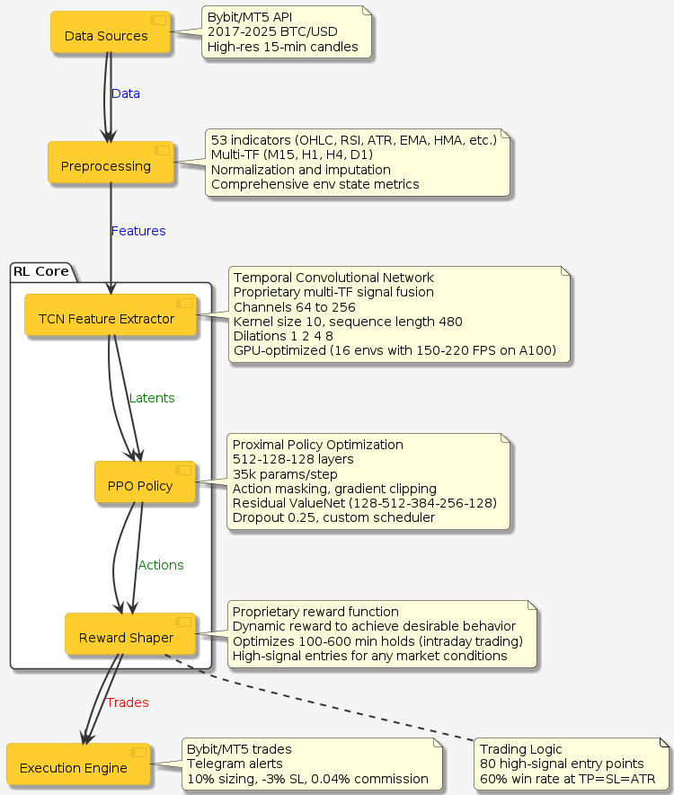

# RL BTC Trading Agent 🚀

A state-of-the-art reinforcement learning agent for BTC/USD trading, crafted over 8 months with a custom PPO environment and advanced feature engineering. This proprietary model leverages 80 high-signal entry points, multi-timeframe analysis, and a sophisticated reward function to deliver robust performance across market conditions. The repo showcases the infrastructure: data pipelines, execution, and logging.

  

## 🌟 Technical Innovations
- **Custom RL Environment**: PPO-based with action masking, processing 35,000+ parameters/step across M15, H1, H4, D1 timeframes.
- **Feature Extraction**: Temporal Convolutional Network (TCN) with 64-256 channels, dilations [1,2,4,8], and sequence length 480, capturing multi-TF dynamics.
- **Policy Network**: 512-128-128 layers, enhanced by gradient hooks for stability and anti-overfitting design.
- **Value Network**: Residual connections (128-512-384-256-128), layer normalization, and dropout (0.25) for robust value estimation.
- **Reward Function**: Proprietary, optimizes 100-600 min holds, balances long/short entries, and prioritizes high-signal trades (80 entry points with 60% win rate at TP=SL=ATR).
- **Observations**: Comprehensive state with 53 indicators (OHLC, RSI, ATR, EMA, HMA) and environment metrics, fully normalized.
- **Compute**: GPU-optimized, achieving 150-220 FPS on A100 across 16 parallel environments.

  
*High-level pipeline: Data → TCN → PPO → Execution.*

## 🛠️ Infrastructure
- **Data Pipeline**: Fetches high-res BTC/USD candles (2017-2025) via Bybit/MT5 APIs, with advanced normalization and imputation (`get_last_candles.py`).
- **Execution**: Seamless Bybit/MT5 integration with optimized low-latency execution, 10% position sizing, -3% stop-loss, 0.04% commission (`trade_on_bybit.py`, `trade_mt5.py`).
- **Trading Logic**: 80 high-signal entry points derived from market patterns, achieving 60% win rate at TP=SL=ATR (see `enter_points/`).
- **Monitoring**: Detailed trade logs and signal analysis (`log_example.txt`).

  
*Example of high-signal entry (anonymized, win rate >60%).*

  
*Telegram notification for trade execution.*

## 🧠 Challenges Overcome
- Mitigated gradient explosion/vanishing with custom gradient hooks and optimization.
- Engineered proprietary reward function to balance long/short entries and enforce 100-600 min holds.
- Ensured zero overfitting via RL design and out-of-sample validation.
- Processed 35k+ parameters/step across 2017-2025 data.

## 📁 Repository Contents
- `get_last_candles.py`: Fetches Bybit candles.
- `get_action.py`: Processes RL actions.
- `run_pipeline.py`/`run_pipeline.bat`: Orchestrates data and execution.
- `trade_mt5.py`/`trade_on_bybit.py`: Executes trades on MT5/Bybit.
- `enter_points/`: CSV files with anonymized entry point data.
- `log_example.txt`: Sample trade log with normalized observations.
- `images/`:
  - `architecture.png`: System architecture.
  - `reward.png`, `networth_drawdown_winrate.png`, `trading_metrics.png`: TensorBoard metrics.
  - `strategy1.png`, `strategy2.png`: TradingView entry point examples.
  - `telegram_notifications.png`: Telegram trade notification.
- `rl_actions_history.csv`: Action history sample.

## 📈 Performance
- Robust across diverse market conditions, profitable from epoch 1.
- Enhances 80 high-signal entry points (over 60% win rate at TP=SL=ATR without optimisation).
- Consistent out-of-sample performance with low drawdown.

## 🚀 Future Plans
- RL-driven risk sizing (dynamic lot sizes).
- Multi-asset expansion (XAU, S&P, ETH) for portfolio diversification.
- High-frequency trading adaptation with external infrastructure.

## 🙌 Acknowledgments
- Built with PyTorch, Stable-Baselines3.
- Inspired by quant trading community.
- Feedback welcome via issues!

## License
MIT License (see `LICENSE`).
''')